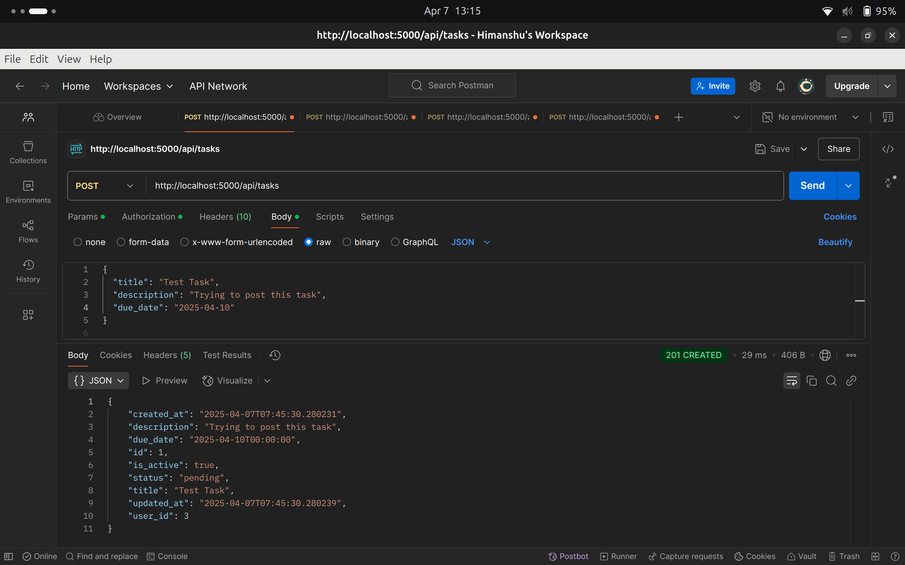

# 🗂️ Task Manager Backend (Flask + Celery + Redis + PostgreSQL+ Docker)

This is a fully Dockerized backend API for managing tasks with async CSV imports, soft deletes, user auth, and audit logging.  
It’s built using Flask, PostgreSQL, Redis, Celery, and JWT. The structure is clean, scalable, and ready for production with just a few RBAC rules left to implement.

## 📦 Tech Stack

- **Flask** – Core web framework
- **PostgreSQL** – Relational database via SQLAlchemy ORM
- **Celery + Redis** – For background task processing (CSV import, etc.)
- **JWT** – Secure authentication
- **Docker** – Containerized architecture with Postgres, Redis, and Flask
- **Alembic** – For database migrations

## 📁 Folder Structure
```bash
task_project/
├── app/
│   ├── api/
│   │   ├── auth_routes.py       # /register and /login endpoints
│   │   └── task_routes.py       # /tasks endpoints + CSV upload
│   ├── models/
│   │   ├── user.py              # User model with roles and password hashing
│   │   └── task.py              # Task + TaskLogger models with soft delete
│   ├── services/
│   │   └── csv_loader.py        # CSV parsing and async loader
│   ├── tasks/
│   │   └── __init__.py          # Celery background task definitions
│   ├── extensions.py            # DB, Redis, Celery, JWT initialization
│   ├── __init__.py              # App factory setup
│   └── config.py                # Dev/prod environment configurations
├── migrations/                  # Alembic migration scripts
├── screenshots/                 # API screenshots (for docs)
├── Dockerfile                   # Dockerfile for Flask app
├── docker-compose.yml           # Multi-container setup (Flask, Redis, Postgres)
├── requirements.txt             # Python dependencies
└── run.py                       # Main app entry point

```

## 🔧 Running the Project

Make sure you have Docker and Docker Compose installed.

### Step-by-step:

```bash
# Clone the project
git clone <https://github.com/Himanshu-0801/Task_List>
cd task_project

# Build and start all services
docker-compose up --build

# Apply migrations inside the running container
docker exec -it task_project_web bash
flask db upgrade
```

---

## 📬 API Overview

| Endpoint               | Method | Auth | Description                        |
|------------------------|--------|------|------------------------------------|
| `/api/register`        | POST   | ✅   | Register new user                  |
| `/api/login`           | POST   | ✅   | Log in and receive access token    |
| `/api/tasks`           | GET    | ✅   | Get all tasks for current user     |
| `/api/tasks`           | POST   | ✅   | Create a new task                  |
| `/api/upload-csv`      | POST   | ✅   | Upload CSV to import tasks (async) |

---

## 🧪 Example: Register

```json
POST /api/register
Content-Type: application/json

{
  "username": "sonu",
  "email": "sonu@example.com",
  "password": "test123",
  "role": "user"
}
```

---

## 📸 Screenshots

Make sure to keep screenshots in a `screenshots/` folder for easy reference in docs.

### 🔐 Register


### 🔑 Login


### 🧾 CSV Upload


### 📋 Task Listing


---

## ⚠️ Error Handling

The API handles errors cleanly and consistently:

| Code | Meaning                        | Example                                |
|------|--------------------------------|----------------------------------------|
| 400  | Bad request                    | Missing fields, invalid data           |
| 401  | Unauthorized                   | No token or invalid token              |
| 403  | Forbidden (RBAC-ready)         | User lacks permission (WIP)            |
| 500  | Internal server error          | Unexpected issues like DB connection   |

---

## 🔐 RBAC (Role-Based Access Control)

- ✅ Roles like `admin`, `manager`, and `user` are already part of the model and JWT payload.
- ✅ Helper functions like `is_admin()` and `is_manager()` are in place.
- ⏳ Authorization logic per route (e.g. admin-only logs) is **ready to implement**.


## 🙋‍♂️ Author

Built by **Himanshu Yadav** as part of a high-performance backend development project using modern Flask practices and a robust async architecture.

If you're reviewing this repo, feel free to test everything locally using Docker — it’s all clean and reproducible.

